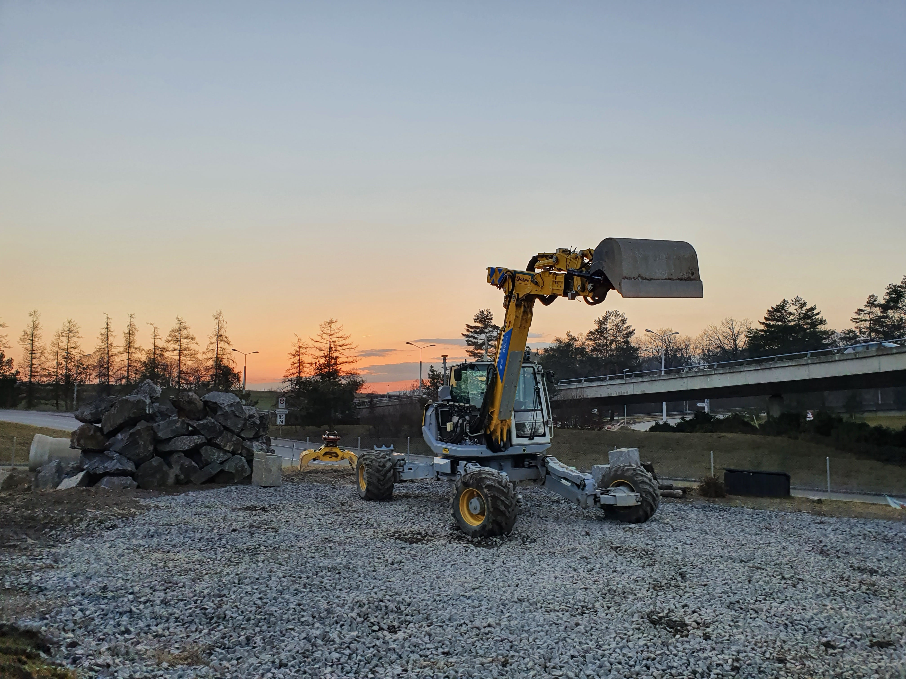

# RSL HEAP
This repository is a collection of material for the HEAP excavator at the Robotic Systems Lab at ETH Zurich.
The main contributors of this repository and the linked resources  are (ordered alphatically by last name):

**Burak Cizmezi, Pascal Egli, Edo Jelavic, Ryan Johns, Dominic Jud, Simon Kerscher, Grzegorz Malczyk, Fang Nan, 
Julian Nubert, Lorenzo Terenzi, Marco Tranzatto, Fan Yang**

## Resources
This repository will be continously updated over the coming months and years.
The main content will consist of resources to run and reproduce our open-source code, recorded datasets, recent related
publiations and other material.

### HEAP URDF
The [./heap_urdf](./heap_urdf) directory contains a URDF with the full HEAP collision model.

### Recent Publications
#### 2022
* Pascal Egli, Dominique Gaschen, Simon Kerscher, Dominic Jud, Marco Hutter, "Soil-Adaptive Excavation Using 
Reinforcement Learning", IROS2022
  * [Paper](https://www.research-collection.ethz.ch/handle/20.500.11850/557541)
* Julian Nubert, Etienne Walther, Shehryar Khattak, Marco Hutter, "Learning-based Localizability Estimation for Robust 
LiDAR Localization", IROS2022
  * Code: [https://github.com/leggedrobotics/L3E](https://github.com/leggedrobotics/L3E)
  * [Paper](https://arxiv.org/abs/2203.05698)
* Edo Jelavic, Julian Nubert, Marco Hutter, "Open3D SLAM: Point Cloud Based Mapping and Localization for Eduation",
ICRA2022 Workshop
  * Code: [https://github.com/leggedrobotics/open3d_slam](https://github.com/leggedrobotics/open3d_slam)
  * [Poster](https://www.research-collection.ethz.ch/handle/20.500.11850/551852)
* Julian Nubert, Shehryar Khattak, Marco Hutter, "Graph-based Multi-sensor Fusion for Consistent Localization of 
Autonomous Construction Robots", ICRA2022
  * Code: [https://github.com/leggedrobotics/graph_msf](https://github.com/leggedrobotics/graph_msf)
  * [Paper](https://arxiv.org/pdf/2203.01389.pdf)
* Edo Jelavic, Tun Kapgen, Simon Kerscher, Dominic Jud, Marco Hutter, "Harveri: A Small (Semi-) Autonomous Precision 
Tree Harvester", ICRA2022 Workshop
  * [Paper](https://www.research-collection.ethz.ch/handle/20.500.11850/549974)

### Datasets
* Data accompanying to our ICRA2022 paper:
  * [Google Drive Link](https://drive.google.com/drive/folders/1qZg_DNH3wXnQu4tNIcqY925KZFDu8y0M?usp=sharing)
  * Contains: IMU measurements, LiDAR odometry from CompSLAM, Left and Right GNSS measurements, and an (arm-)filtered point cloud.
